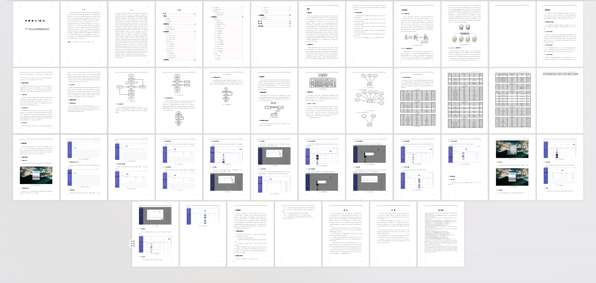
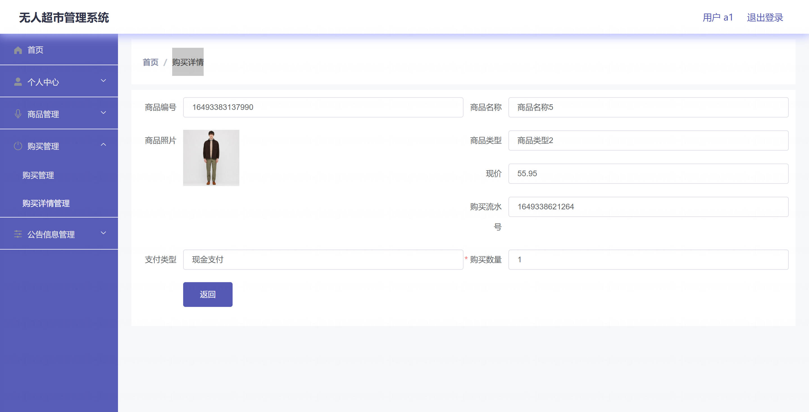

<h1 align="center">基于Spring Boot 的无人超市管理系统【带论文】</h1>

- <b>完整代码获取地址：从戎源码网 ([https://armycodes.com/](https://armycodes.com/))</b>
- <b>技术探讨、资料分享，请加QQ群：692619798</b>
- <b>作者微信：19941326836  QQ：3645296857</b>
- <b>承接计算机毕业设计、Java毕业设计、Python毕业设计、深度学习、机器学习</b>
- <b>选题+开题报告+任务书+程序定制+安装调试+论文+答辩ppt 一条龙服务</b>
- <b>所有选题地址 ([https://github.com/Descartes007/allProject](https://github.com/Descartes007/allProject)) </b>

## 一、项目介绍

### 本项目为基于 Spring Boot 的无人超市管理系统，面向后台管理人员与终端用户（顾客），系统角色主要为管理员和普通用户（用户/顾客）。主要功能如下：
### 管理员：
- 基本操作：登录、登出、修改密码、获取/修改个人信息
### 用户管理：用户列表分页、查看详情、新增/编辑/删除用户、重置密码
### 商品管理：商品分页、查看详情、新增、编辑、上下架管理
### 出入库管理：出入库单与明细的新增/编辑/查询/删除
- 收银/购买管理：创建购买单、购买明细管理、购买记录查询
### 公告管理：发布/编辑/删除公告与分页查询
### 普通用户（顾客）：
### 注册/登录/退出
- 浏览商品：商品列表、商品详情（仅已上架商品）
- 下单/购买：生成购买单并查看购买明细
- 个人中心：查看/修改个人信息、修改密码

## 二、项目技术

- 编程语言：Java（后端）
- 项目架构：B/S 架构
- 前端技术：Vue.js 2、Element UI，vue-router，axios
- 后端技术：
- 框架：Spring Boot（Spring生态），MyBatis-Plus，FastJSON、Apache Commons

## 三、运行环境

- JDK版本：1.8及以上都可以
- 操作系统：Windows7/10、MacOS
- 开发工具：IDEA、Ecplise、MyEclipse都可以

## 四、数据库配置文件

- npm版本：6.14.13及以上都可以
- Redis版本：3.2.100及以上都可以
- 文件名：application.yml
- 编码类型：utf8

## 论文截图

## 系统截图

